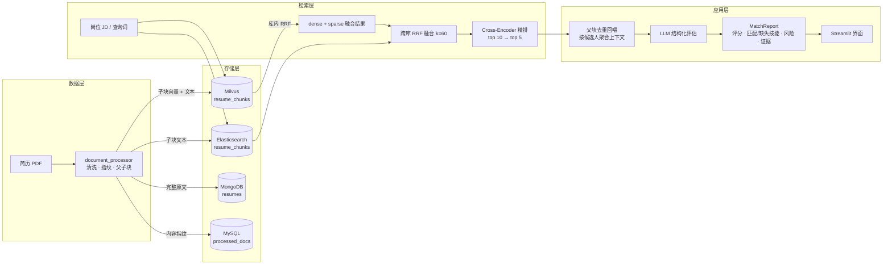

# SmartRecruit · 智能简历推荐系统

基于 LangChain 的 RAG 简历检索与候选人推荐系统。输入一段岗位 JD，系统从简历库中完成 **多路召回 → 融合排序 → 精排 → LLM 结构化评估**，输出带评分、技能匹配、风险点和原文证据的候选人排序。

围绕同一份存储，方案没有用"一个向量库打天下"，而是让 **Milvus / Elasticsearch / MongoDB / MySQL 各自承担它最擅长的那部分**，并把三条检索通道的分数用 RRF 融合、再用 Cross-Encoder 精排。


---

## 核心特性

- **四库分工持久化** — 向量、倒排、原文、判重各司其职，全部幂等写入，重复入库不产生脏数据
- **三层检索链路** — 库内混合检索（Milvus 稠密 + 稀疏）→ 跨库 RRF 融合（+ ES BM25）→ Cross-Encoder 精排
- **零本地模型** — 稠密向量与精排全部走云端 API，Milvus 内置 BM25 Function 负责稀疏通道，不需要下载 BGE-M3 之类的本地权重
- **父子块层级切块** — 子块（400 字）参与检索保证召回精准，父块（1000 字）回喂 LLM 保证上下文完整
- **文档指纹去重** — SHA-256 内容指纹 + 唯一索引，同一份简历重复入库自动跳过
- **结构化输出** — 用 Pydantic 模型约束 LLM 输出，直接得到可渲染的字段而不是一段散文
- **可视化界面** — Streamlit 单页应用，含四库指标、批量入库、岗位匹配、召回预览（可看到每条命中的召回路径）

---

## 系统架构



---

## 检索链路

### 1. 双路召回

同一个查询并发走两条通道：

| 通道 | 实现 | 擅长 |
|---|---|---|
| 稠密语义 | Milvus `resume_chunks.dense_vector`（1024 维，FLAT + IP） | "熟悉容器编排" ↔ "K8s 生产经验"这类**同义不同词** |
| 稀疏关键词 | Milvus BM25 Function（服务端从 `text` 字段自动生成 `sparse_vector`）+ ES IK 替代方案 `cjk` 分析器 | 精确术语、版本号、公司名、专有名词 |

Milvus 侧两个通道用 `RRFRanker` 先做库内融合；ES 侧作为第三条独立通道参与跨库融合。

### 2. 跨库 RRF 融合

Milvus 的 IP 分数在 0~1 区间，ES 的 BM25 分数**没有上界**，两者量纲不同不能加权求和。因此跨库统一走 RRF（Reciprocal Rank Fusion，`k=60`）——只看排名不看分数：

```
score(d) = Σ 1 / (k + rank_i(d))
```

每条结果都带上 `route` 标记（`milvus_hybrid` / `es_bm25`），所以界面上能直接看出某个片段是被哪条通道召回的（见下方"召回预览"截图里的「召回路径」列）。

### 3. Cross-Encoder 精排

RRF 只是把候选池排好序，真正的相关性判断交给精排模型：宽召回 10 条 → 精排取前 5 条。实测这一步会实际改变顺序（例如某次检索中 RRF 排第一的"项目经历"块，精排后被一条 FastAPI 相关度 0.98 的片段取代），这正是"宽召回 → 精排"两级结构的价值。

> 踩坑记录：精排接口走的是 DashScope **原生路径** `/api/v1/services/rerank/text-rerank/text-rerank`，OpenAI 兼容模式的 `/compatible-mode/v1/rerank` 会返回 404；代码里由 `resolve_rerank_url()` 从 base_url 自动推导。

### 4. 父块回喂 + 去重

子块命中后，回喂给 LLM 的是它所属的**父块**（1000 字）。多条子块命中同一个父块时按 `parent_id` 去重——实测命中 3 条子块时上下文长度不变，既省 token 又避免同一段文字重复出现干扰模型。

### 5. LLM 结构化评估

上下文按候选人（`doc_hash`）聚合后交给 LLM，用 `with_structured_output` + Pydantic 约束输出结构，得到：

- `match_score`（0~100）、`recommendation`（强烈推荐 / 可以考虑 / 不推荐）
- `matched_skills` / `missing_skills`、`experience_years`
- `risk_points`（需要面试确认的疑点）
- `evidence`（必须引用原文片段，便于人工复核）


---

## 四库分工

| 组件 | 存什么 | 为什么用它 | 幂等策略 |
|---|---|---|---|
| **Milvus 3.0** | 子块稠密向量 + 原始文本 | 语义召回；内置 BM25 Function 直接产出稀疏向量，省掉一个本地模型 | `upsert`（按主键覆盖） |
| **Elasticsearch 9.1** | 子块文本 + 元数据 | BM25 关键词召回；无 IK 插件时用内置 `cjk` 分析器（CJK bigram） | 同 `_id` 覆盖写入 |
| **MongoDB 5.0** | 简历完整原文（父块 + 全文） | 回喂 LLM 时取完整档案；`doc_hash` 建唯一索引 | `update_one(upsert=True)` |
| **MySQL 8.0** | 已处理文档登记表 | 跨轮次判重的权威账本，事务语义清晰 | `ON DUPLICATE KEY UPDATE` |

配套还起了 etcd / MinIO（Milvus 依赖）和 Attu（Milvus 可视化）——共 7 个容器，全部由 `docker-compose.yml` 编排。

---

## 关键设计决策

**为什么父子块而不是单一粒度？**
小块检索准但上下文碎，大块上下文全但向量被稀释。拆成"子块检索 + 父块回喂"两边的好处都要。

> 踩坑记录：PyPDFLoader 逐页返回文本，拼页时必须用 `\n` 而不是 `\n\n`。因为 `RecursiveCharacterTextSplitter` 对超长片段会**递归**切分，`\n\n` 会被识别成分段符，导致跨页的子块不再与兄弟合并、页边界变隐形屏障。`tests/test_document_processor.py` 里有一条专门固化这个行为的回归测试。

**为什么走 RRF 而不是加权求和？**
见上文——跨库分数量纲不可比。RRF 只用排名，天然规避归一化问题，也不需要调权重。

**为什么要用四个库？**
不是为了堆技术栈，而是这四类数据的最优存储形态不同：向量适合 ANN 索引、文本适合倒排、原文适合文档库、判重账本适合事务表。用 MySQL 一张表塞下全部，任何一项都会将就。

**为什么切块参数是 1000 / 400 / 50？**
父块 1000 字约等于简历里一个完整经历段落，子块 400 字保住了"一段经历"的语义完整性，50 字重叠防止句子被切在边界上丢语义。这三个值集中在 `document_processor.py` 顶部，可调。

---

## 实测结果

用 8 份不同方向的简历（Python 后端 / Java 后端 / 前端 / 算法 / 数据分析 / 测试 / 大数据 / DevOps）灌库，跑三个岗位做端到端验证：

| 岗位方向 | 命中的第一名 | 得分 | 其他候选人 |
|---|---|---|---|
| Python 后端（RAG 方向） | 张伟 | 92 | 张三 72（同为后端，技能栈略窄） |
| Java 后端（高并发） | 李娜 | 95 | 张伟 30（只匹配到"高并发"一项） |
| 前端工程师 | 王强 | 95 | 张伟 10 / 张三 8 |

- **排序正确性**：三个岗位的第一名都是对应方向的简历，不相关候选人稳定落在低分区（8~30 分），没有出现"高分错配"
- **跨轮次判重**：8 份简历第二次批量入库时全部返回"已处理，跳过"，未产生重复数据（四库计数不变）
- **父子块去重**：命中多条子块、回喂父块时上下文长度保持不变
- **分数浮动**：`temperature=0.1` 下同一输入同一 JD 的评分会有 ±3 分左右浮动（张伟在两次运行中分别为 92 和 95），不影响排序

> 测试用简历由脚本程序化生成（`reportlab` + 中文 CID 字体），不包含任何真实个人数据，也未纳入本仓库。

---

## 快速开始

### 1. 前置条件

- Docker（含 Compose V2）
- Python 3.13
- 三组模型服务凭据：**chat / embedding / rerank**（可分别来自不同供应商，都通过环境变量配置）

> Elasticsearch 前置：WSL2 里需先执行 `sysctl -w vm.max_map_count=262144`，否则容器起不来。

### 2. 启动四库

```bash
docker compose up -d
docker compose ps        # 等 7 个容器全部 healthy
```

| 服务 | 地址 |
|---|---|
| Milvus | `localhost:19530`（WebUI `9091`） |
| Elasticsearch | `localhost:9200` |
| MongoDB | `localhost:27017` |
| MySQL | `localhost:3306` |
| Attu（Milvus 可视化） | `localhost:8000` |
| MinIO 控制台 | `localhost:9001` |

### 3. 配置 `.env`

在项目根目录创建 `.env`（已在 `.gitignore` 中，不会被提交）：

```ini
# ---- LLM（OpenAI 兼容协议）----
LLM_BASE_URL=
LLM_API_KEY=
LLM_MODEL=
LLM_TEMPERATURE=0.1

# ---- Embedding（OpenAI 兼容协议）----
EMBEDDING_BASE_URL=
EMBEDDING_API_KEY=
EMBEDDING_MODEL=
EMBEDDING_DIM=1024          # 必须与模型实际维度一致

# ---- Rerank ----
RERANK_BASE_URL=            # 会自动推导出原生 rerank 端点
RERANK_API_KEY=
RERANK_MODEL=

# ---- 四库连接 ----
MILVUS_HOST=localhost
MILVUS_PORT=19530
ES_HOST=http://localhost
ES_PORT=9200
MONGO_HOST=localhost
MONGO_PORT=27017
MONGO_USER=root
MONGO_PASSWORD=
MONGO_DATABASE=smartrecruit
MYSQL_HOST=localhost
MYSQL_PORT=3306
MYSQL_USER=root
MYSQL_PASSWORD=
MYSQL_DATABASE=smartrecruit
```

本项目实测使用 `deepseek-v4-flash-0731`（chat）、`qwen3.7-text-embedding`（1024 维）、`qwen3.7-text-rerank`（精排），三者均为独立配置，可自由替换。

### 4. 安装依赖

```bash
python -m venv .venv
.venv\Scripts\activate           # macOS/Linux: source .venv/bin/activate
pip install -r requirements.txt

# torch 需单独指定源（CUDA 12.8）
pip install torch==2.11.0 torchvision --index-url https://download.pytorch.org/whl/cu128
```

### 5. 运行

```bash
streamlit run app.py
```

浏览器打开 `http://localhost:8501`：

- **侧边栏** — 四库实时指标（Milvus 文本块数 / ES 文档数 / Mongo 原文数 / MySQL 登记数）
- **批量入库** — 上传 PDF 或指定目录，重复文件自动跳过
- **岗位匹配** — 粘贴 JD，得到候选人卡片（评分、技能匹配、风险点、原文证据）
- **召回预览** — 只跑检索不调 LLM，可查看每条命中的召回路径与精排分数

### 6. 测试

```bash
pytest tests -v
```

14 个用例，全部为纯函数测试（不连库、不调外部 API），覆盖文本归一化、去噪截断、指纹稳定性、切块重叠、跨页边界回归、RRF 融合数学、rerank 端点推导。

---

## 项目结构

```
Smartrecruit/
├─ app.py                    # Streamlit 界面（展示层与业务逻辑解耦）
├─ document_processor.py     # PDF 加载 → 清洗 → 指纹 → 层级切块
├─ vector_store.py           # 四库连接与幂等写入 + 三层检索
├─ chain.py                  # Prompt 模板 + LLM 结构化输出
├─ rag_pipeline.py           # 端到端编排（入库 / 检索 / 匹配 / 统计）
├─ docker-compose.yml        # 四库 + Attu 编排（7 容器）
├─ requirements.txt
├─ .streamlit/config.toml    # 深色主题
├─ explore/                  # 开发期探针脚本（连通性、切块、去重验证）
├─ tests/                    # pytest 单测
└─ docs/screenshots/
```

分层原则：`vector_store` 只管存储与检索、`chain` 只管 Prompt 与模型调用、`rag_pipeline` 负责编排、`app.py` 只负责渲染和交互。所以换 UI 或换模型供应商时，改动都局限在单个文件里。

---

## 已知限制

- 仅支持**文本型 PDF**，扫描件需先做 OCR
- LLM 评分存在 ±3 分浮动的固有不确定性，排序稳定但分数不宜作为绝对阈值
- 无用户体系与多租户隔离，定位是单机演示 / 内部工具
- 检索质量目前依赖人工抽样验证，尚未建立带标注的评估集（Recall@K / MRR 未量化）

## 后续可做

- 接入 OCR 扩展扫描件支持
- 建立标注评估集，量化 Recall@K、MRR、nDCG
- 把 pipeline 拆成 FastAPI 服务 + 独立前端（前后端分离）
- 评估结果 SSE 流式返回
