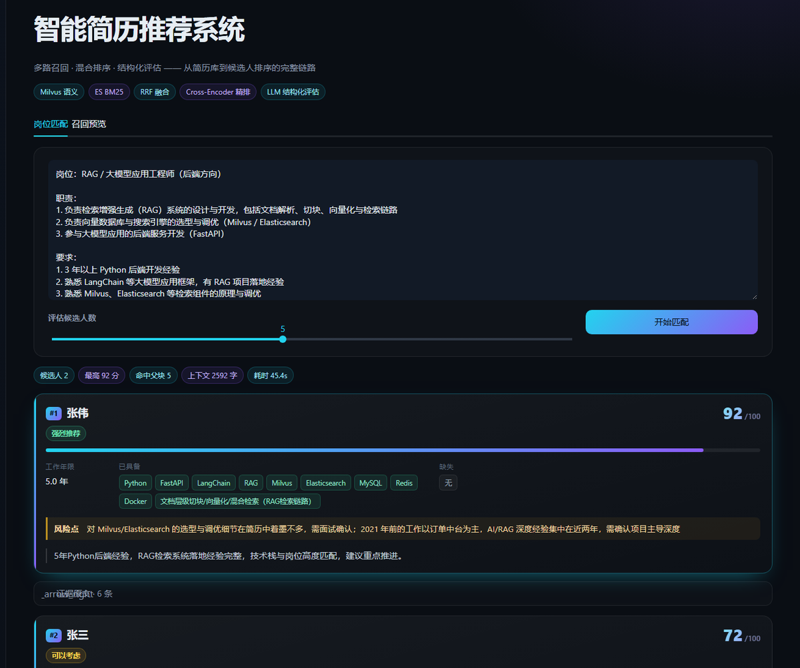
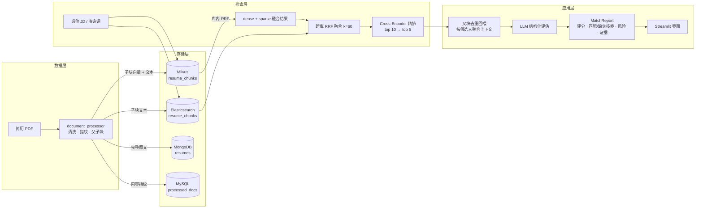
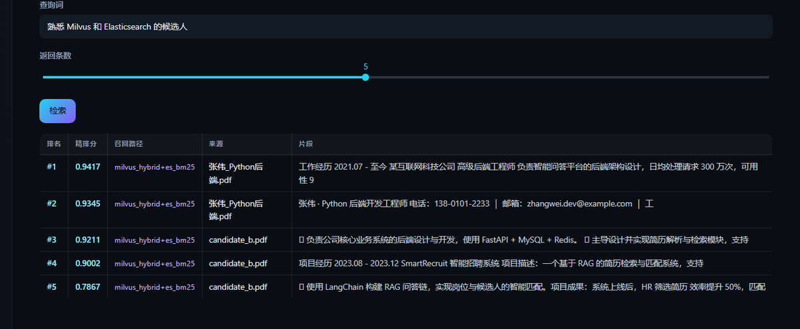

# SmartRecruit · 智能简历推荐系统

基于 LangChain 的 RAG 简历检索与候选人推荐系统。输入岗位 JD，系统从简历库中执行 **多路召回 → 融合排序 → 精排 → LLM 结构化评估**，输出包含评分、技能匹配、风险点与原文证据的候选人排序。

存储层由 Milvus / Elasticsearch / MongoDB / MySQL 四库协同：向量检索、倒排检索、原文存储、判重登记分别交由最适配的组件承担；三条检索通道的排序结果经 RRF 融合，再由 Cross-Encoder 精排。



---

## 核心特性

- **四库分工持久化** — 向量、倒排、原文、判重各司其职，写入均为幂等操作，重复入库不产生脏数据
- **三层检索链路** — 库内混合检索（Milvus 稠密 + 稀疏）→ 跨库 RRF 融合（+ ES BM25）→ Cross-Encoder 精排
- **零本地模型** — 稠密向量与精排均调用云端 API；稀疏通道由 Milvus 内置 BM25 Function 生成，无需部署 BGE-M3 等本地权重
- **父子块层级切块** — 子块（400 字）参与检索以保证召回精度，父块（1000 字）回喂 LLM 以保证上下文完整
- **文档指纹去重** — SHA-256 内容指纹配合唯一索引，同一份简历重复入库自动跳过
- **结构化输出** — 以 Pydantic 模型约束 LLM 输出，直接获得可渲染字段
- **可视化界面** — Streamlit 单页应用，提供四库指标、批量入库、岗位匹配与召回预览（含每条命中的召回路径）

---

## 系统架构



---

## 检索链路

### 1. 双路召回

同一查询并发执行两条通道：

| 通道 | 实现 | 适用场景 |
|---|---|---|
| 稠密语义 | Milvus `resume_chunks.dense_vector`（1024 维，FLAT + IP） | 同义不同词的表达，如"熟悉容器编排"与"K8s 生产经验" |
| 稀疏关键词 | Milvus BM25 Function（服务端由 `text` 字段生成 `sparse_vector`）+ ES `cjk` 分析器 | 精确术语、版本号、公司名、专有名词 |

Milvus 侧的两个通道先经 `RRFRanker` 完成库内融合，ES 作为第三条独立通道参与跨库融合。

### 2. 跨库 RRF 融合

Milvus 的 IP 分数位于 0~1 区间，ES 的 BM25 分数无上界，两者量纲不可比，无法加权求和。跨库统一采用 RRF（Reciprocal Rank Fusion，`k=60`），仅依据排名计算：

```
score(d) = Σ 1 / (k + rank_i(d))
```

每条结果附带 `route` 标记（`milvus_hybrid` / `es_bm25`），界面「召回路径」列即由此渲染。

### 3. Cross-Encoder 精排

RRF 负责生成候选排序，相关性判定交由精排模型完成：召回 10 条，精排保留前 5 条。该步骤会实际改变顺序——某次检索中 RRF 排名第一的经历块，精排后被一条相关度 0.98 的 FastAPI 片段取代，两级排序的作用由此体现。

精排调用 DashScope 原生端点 `/api/v1/services/rerank/text-rerank/text-rerank`；OpenAI 兼容模式的 `/compatible-mode/v1/rerank` 返回 404。代码中由 `resolve_rerank_url()` 从 base_url 自动推导端点。

### 4. 父块回喂与去重

子块命中后，回喂 LLM 的是其所属父块（1000 字）。多条子块命中同一父块时按 `parent_id` 去重：实测命中 3 条子块与命中 1 条时上下文长度一致，可降低 token 消耗并避免同段文本重复出现。

### 5. LLM 结构化评估

上下文按候选人（`doc_hash`）聚合后交由 LLM，通过 `with_structured_output` 与 Pydantic 约束输出：

- `match_score`（0~100）、`recommendation`（强烈推荐 / 可以考虑 / 不推荐）
- `matched_skills` / `missing_skills`、`experience_years`
- `risk_points`（需面试确认的疑点）
- `evidence`（引用原文片段，便于人工复核）



---

## 四库分工

| 组件 | 存什么 | 为什么用它 | 幂等策略 |
|---|---|---|---|
| **Milvus 3.0** | 子块稠密向量 + 原始文本 | 语义召回；内置 BM25 Function 直接产出稀疏向量，省去一个本地模型 | `upsert`（按主键覆盖） |
| **Elasticsearch 9.1** | 子块文本 + 元数据 | BM25 关键词召回；无 IK 插件时使用内置 `cjk` 分析器（CJK bigram） | 同 `_id` 覆盖写入 |
| **MongoDB 5.0** | 简历完整原文（父块 + 全文） | 回喂 LLM 时取完整档案；`doc_hash` 建唯一索引 | `update_one(upsert=True)` |
| **MySQL 8.0** | 已处理文档登记表 | 跨轮次判重的权威账本，事务语义明确 | `ON DUPLICATE KEY UPDATE` |

另有 etcd / MinIO（Milvus 依赖）与 Attu（Milvus 可视化），共 7 个容器，均由 `docker-compose.yml` 编排。

---

## 设计考量

**父子块切分**。单一粒度存在取舍：小块检索精度高但上下文割裂，大块上下文完整但向量语义被稀释。采用"子块检索 + 父块回喂"，兼顾召回精度与上下文完整性。

**分页拼接使用 `\n` 而非 `\n\n`**。`RecursiveCharacterTextSplitter` 对超长片段执行递归切分，`\n\n` 会被识别为段落分隔符，导致跨页子块不再与相邻片段合并，页边界形成隐性屏障。`tests/test_document_processor.py` 中有对应回归测试固化该行为。

**RRF 而非加权求和**。跨库分数量纲不可比（见「检索链路」），RRF 仅依赖排名，无需归一化处理与权重调参。

**四库的取舍依据**。四类数据的最优存储形态不同：向量适配 ANN 索引、文本适配倒排、原文适配文档库、判重账本适配事务表。若合并至单库单表，任一项都需让步。

**切块参数 1000 / 400 / 50**。父块 1000 字约等于简历中一个完整经历段落；子块 400 字保持该段落的语义完整性；50 字重叠避免句子被切断造成语义损失。参数集中于 `document_processor.py` 顶部，可调整。

---

## 实测结果

以 8 份不同方向的简历（Python 后端 / Java 后端 / 前端 / 算法 / 数据分析 / 测试 / 大数据 / DevOps）入库，选取三个岗位做端到端验证：

| 岗位方向 | 第一名 | 得分 | 其他候选人 |
|---|---|---|---|
| Python 后端（RAG 方向） | 张伟 | 92 | 张三 72（同为后端，技能栈较窄） |
| Java 后端（高并发） | 李娜 | 95 | 张伟 30（仅匹配"高并发"一项） |
| 前端工程师 | 王强 | 95 | 张伟 10 / 张三 8 |

- **排序正确性**：三个岗位的第一名均为对应方向简历，非相关候选人稳定落在 8~30 分区间
- **跨轮次判重**：8 份简历二次批量入库全部返回"已处理，跳过"，四库计数不变
- **父块去重**：多条子块命中同一父块时，回喂上下文长度不变
- **分数浮动**：`temperature=0.1` 下，同一 JD 同一输入存在 ±3 分浮动（张伟两次运行分别为 92 与 95），排序不受影响

测试简历由脚本程序化生成（`reportlab` + 中文 CID 字体），不含真实个人数据，未纳入本仓库。

---

## 快速开始

### 1. 前置条件

- Docker（含 Compose V2）
- Python 3.13
- 三组模型服务凭据：**chat / embedding / rerank**，可分别来自不同供应商，均通过环境变量配置

> Elasticsearch 前置：WSL2 中需先执行 `sysctl -w vm.max_map_count=262144`，否则容器无法启动。

### 2. 启动四库

```bash
docker compose up -d
docker compose ps        # 待 7 个容器全部 healthy
```

| 服务 | 地址 |
|---|---|
| Milvus | `localhost:19530`（WebUI `9091`） |
| Elasticsearch | `localhost:9200` |
| MongoDB | `localhost:27017` |
| MySQL | `localhost:3306` |
| Attu（Milvus 可视化） | `localhost:8000` |
| MinIO 控制台 | `localhost:9001` |

### 3. 配置 `.env`

在项目根目录创建 `.env`（已列入 `.gitignore`，不会被提交）：

```ini
# ---- LLM（OpenAI 兼容协议）----
LLM_BASE_URL=
LLM_API_KEY=
LLM_MODEL=
LLM_TEMPERATURE=0.1

# ---- Embedding（OpenAI 兼容协议）----
EMBEDDING_BASE_URL=
EMBEDDING_API_KEY=
EMBEDDING_MODEL=
EMBEDDING_DIM=1024          # 必须与模型实际维度一致

# ---- Rerank ----
RERANK_BASE_URL=            # 由该地址自动推导原生 rerank 端点
RERANK_API_KEY=
RERANK_MODEL=

# ---- 四库连接 ----
MILVUS_HOST=localhost
MILVUS_PORT=19530
ES_HOST=http://localhost
ES_PORT=9200
MONGO_HOST=localhost
MONGO_PORT=27017
MONGO_USER=root
MONGO_PASSWORD=
MONGO_DATABASE=smartrecruit
MYSQL_HOST=localhost
MYSQL_PORT=3306
MYSQL_USER=root
MYSQL_PASSWORD=
MYSQL_DATABASE=smartrecruit
```

本项目的实测配置为 chat 模型 `deepseek-v4-flash-0731`、embedding 模型 `qwen3.7-text-embedding`（1024 维）、精排模型 `qwen3.7-text-rerank`。三者独立配置，可替换。

### 4. 安装依赖

```bash
python -m venv .venv
.venv\Scripts\activate           # macOS/Linux: source .venv/bin/activate
pip install -r requirements.txt

# torch 需单独指定源（CUDA 12.8）
pip install torch==2.11.0 torchvision --index-url https://download.pytorch.org/whl/cu128
```

### 5. 运行

```bash
streamlit run app.py
```

浏览器访问 `http://localhost:8501`：

- **侧边栏** — 四库实时指标（Milvus 文本块数 / ES 文档数 / Mongo 原文数 / MySQL 登记数）
- **批量入库** — 上传 PDF 或指定目录，重复文件自动跳过
- **岗位匹配** — 粘贴 JD，获得候选人卡片（评分、技能匹配、风险点、原文证据）
- **召回预览** — 仅执行检索不调用 LLM，可查看每条命中的召回路径与精排分数

### 6. 测试

```bash
pytest tests -v
```

14 个用例，均为纯函数测试（不连库、不调外部 API），覆盖文本归一化、去噪截断、指纹稳定性、切块重叠、跨页边界回归、RRF 融合算法与 rerank 端点推导。

---

## 项目结构

```
Smartrecruit/
├─ app.py                    # Streamlit 界面（展示层与业务逻辑解耦）
├─ document_processor.py     # PDF 加载 → 清洗 → 指纹 → 层级切块
├─ vector_store.py           # 四库连接与幂等写入 + 三层检索
├─ chain.py                  # Prompt 模板 + LLM 结构化输出
├─ rag_pipeline.py           # 端到端编排（入库 / 检索 / 匹配 / 统计）
├─ docker-compose.yml        # 四库 + Attu 编排（7 容器）
├─ requirements.txt
├─ .streamlit/config.toml    # 深色主题
├─ explore/                  # 开发期探针脚本（连通性、切块、去重验证）
├─ tests/                    # pytest 单测
└─ docs/screenshots/
```

分层约定：`vector_store` 负责存储与检索，`chain` 负责 Prompt 与模型调用，`rag_pipeline` 负责流程编排，`app.py` 负责渲染与交互。更换 UI 或模型供应商时，改动局限于单个文件。

---

## 已知限制

- 仅支持文本型 PDF，扫描件需先做 OCR
- LLM 评分存在 ±3 分浮动，排序稳定，分数不宜用作绝对阈值
- 无用户体系与多租户隔离，定位为单机演示 / 内部工具
- 检索质量目前依赖人工抽样验证，尚未建立带标注的评估集（Recall@K / MRR 未量化）

## 后续规划

- 接入 OCR 扩展扫描件支持
- 建立标注评估集，量化 Recall@K、MRR、nDCG
- 将 pipeline 拆分为 FastAPI 服务 + 独立前端
- 评估结果以 SSE 流式返回
